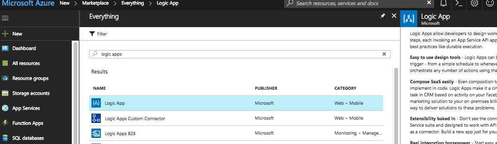
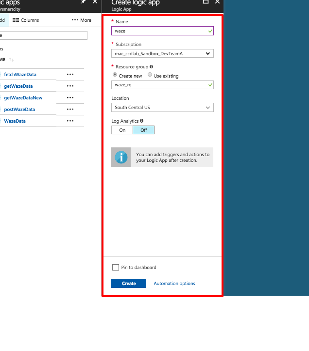
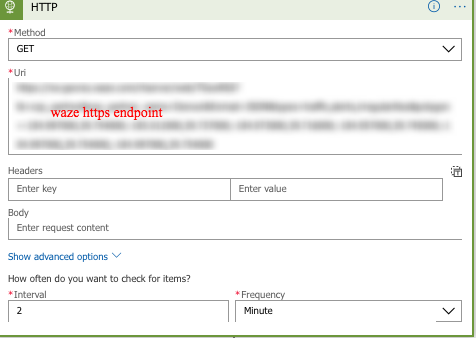
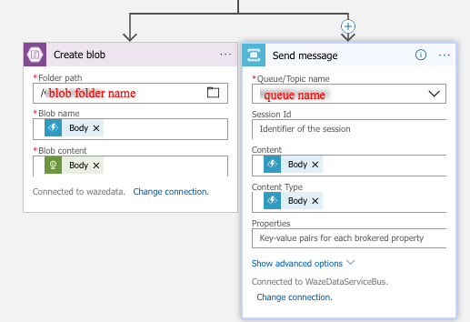
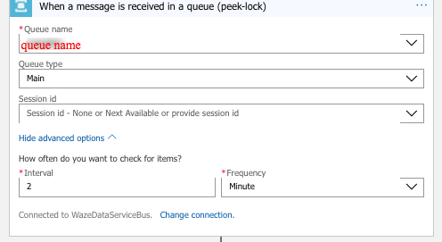
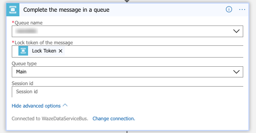
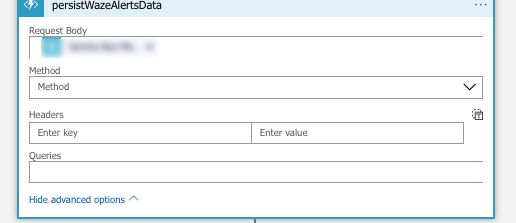
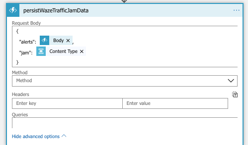

# Azure WazeCCProcessor  
Azure Waze data processor takes [Waze CCP](https://www.waze.com/ccp) data feed by using the Azure Logic Apps and store the data in Azure Blob and each entry in the Azure Service Queue which then be parsed and persisted into Azure tables using Azure Functions.

## Architecture

Placed the pdf version inside the [docs folder](https://github.com/CityofDenver/WazeCCProcessorV1/blob/master/azure/docs/WazeCCPprocessorAzureV1.pdf). 

XML version of the diagram is available inside the [docs folder](https://github.com/CityofDenver/WazeCCProcessorV1/blob/master/azure/docs/WazeCCPprocessorAzureV1.xml) folder which can be opened using the [draw.io](https://www.draw.io/) for future modifications. 

# Logic Apps creation using Azure Templates - 3 steps process

## Step 1

## Step 2 - After successful completion of step 1

Navigate to the debug console associated with the function https://<functionName>.scm.azurewebsites.net/DebugConsole 

Drag and drop all the [functions](https://github.com/CityofDenver/WazeCCProcessorV1/blob/master/azure/code/functions/)

## Step 2 - After successful completion of Step 2

# Logic Apps creation using Azure portal 
1. Login to the Azure portal and click on "New"
2. Search and select Logic App from the results 

3. In the Terms and conditions page, click create

4. Fill the required details and click create 

5. The details will be validated and the Logic App will be deployed to the group mentioned. 

# Logic Apps workflow design using Azure portal to pool and store the waze data - Part 1
1. After the successful completion of the above 5 steps, select a blank template

2. In the logic app designer, create the flow to ingest the waze data using the waze http endpoint URL for specified interval

3. From the http workflow, add a parallel branch to add two actions - blob storage to store the raw data and a queue to add an entry about the new records in the blob storage. 

# Logic Apps workflow design using Azure portal to parse and persist the data in Azure storage tables - Part 2
1. In the logic app designer, select the peek-lock receive a service bus message and complete it and specify the connection name of the service bus ans click create

2. Enter the Service Bus Queue details and create the below flow

3. Map the parses function to parse the data and store into the table

